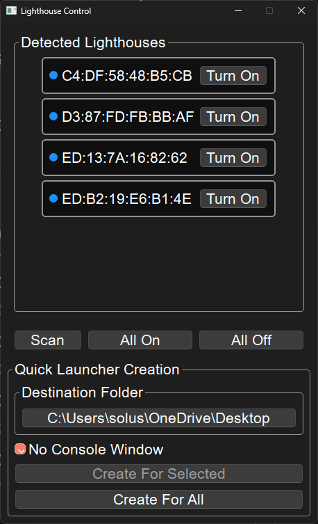

# Lighthouse Control

Turns on/off VR lighthouses. Confirmed working with v2 lighthouses, v1 lighthouse support is untested.

## Requirements
### [Release](https://github.com/kliden/Lighthouse-Control/releases/latest)

Only supports Windows.

The provided .zip file contains two executables: `lighthouse.exe` and `lighthouse_console.exe`. The GUI version is `lighthouse.exe`, the command line version is `lighthouse_console.exe`. The "Quick Launcher Creation" section of `lighthouse.exe` requires `lighthouse_console.exe` to be in the same folder as `lighthouse.exe`. If you ever move them, you'll need to recreate your quick launch scripts using the "Quick Launcher Creation" section.

### Python

`pip install bleak pyperclip pyqt6 qasync`

If you want to build binaries yourself:

<pre>pip install pyinstaller
python build.py</pre>

## Using

### GUI
To use the [Release](https://github.com/kliden/Lighthouse-Control/releases/latest) .exe files, replace `python lighthouse.py` with `lighthouse.exe` in the following commands.

#### Show the GUI

`python lighthouse.py`

It looks like this:

### Command Line
To use the [Release](https://github.com/kliden/Lighthouse-Control/releases/latest) .exe files, replace `python lighthouse.py` with `lighthouse_console.exe` in the following commands.

#### Scan for nearby lighthouses

`python lighthouse.py --scan`

This will also copy the MAC address of all detected lighthouses to your clipboard.

#### Turn on the provided list of lighthouses

`python lighthouse.py on <list of MAC addresses>`

Copy-paste the MAC addresses from the `--scan` command to provide `<list of MAC addresses>`.
